# Load Packages


```r
library(dplyr)
```

```
## 
## Attaching package: 'dplyr'
```

```
## The following objects are masked from 'package:stats':
## 
##     filter, lag
```

```
## The following objects are masked from 'package:base':
## 
##     intersect, setdiff, setequal, union
```

```r
library(ggplot2)
```

# Read Data

Polygon data from BEC subzones intersected with PEM aspect (warm/cool).


```r
Columbia_Area <- read.csv("data/BEC_PEM_Columbia.csv")
Elk_Area <- read.csv("data/BEC_PEM_Elk.csv")
KootenayN_Area <- read.csv("data/BEC_PEM_Kootenay_North.csv")
KootenayS_Area <- read.csv("data/BEC_PEM_Kootenay_South.csv")
Purcell_Area <- read.csv("data/BEC_PEM_Purcell.csv")
```

Polygon data from BEC subzones intersected with PEM aspect (warm/cool), with non-fuels removed using the BCWS Fire Fuel Types dataset. 


```r
Columbia_Fuel <- read.csv("data/BEC_PEM_Columbia_Fuel.csv")
Elk_Fuel <- read.csv("data/BEC_PEM_Elk_Fuel.csv")
KootenayN_Fuel <- read.csv("data/BEC_PEM_Kootenay_North_Fuel.csv")
KootenayS_Fuel <- read.csv("data/BEC_PEM_Kootenay_South_Fuel.csv")
Purcell_Fuel <- read.csv("data/BEC_PEM_Purcell_Fuel.csv")
```

Fire perimeters intersected with BEC subzone and PEM aspect. Contains BEC information for within fire events. Selecting only fire events after 1940. 


```r
Columbia_Fire <- read.csv("data/BEC_Fire_Columbia.csv") %>%
  filter(FIRE_YEAR >= 1940, Calculate_Size_Ha > 0, SIZE_HA > 0)
Elk_Fire <- read.csv("data/BEC_Fire_Elk.csv") %>%
  filter(FIRE_YEAR >= 1940, Calculate_Size_Ha > 0, SIZE_HA > 0)
KootenayN_Fire <- read.csv("data/BEC_Fire_Kootenay_North.csv") %>%
  filter(FIRE_YEAR >= 1940, Calculate_Size_Ha > 0, SIZE_HA > 0)
KootenayS_Fire <- read.csv("data/BEC_Fire_Kootenay_South.csv") %>%
  filter(FIRE_YEAR >= 1940)
Purcell_Fire <- read.csv("data/BEC_Fire_Purcell.csv") %>%
  filter(FIRE_YEAR >= 1940, Calculate_Size_Ha > 0, SIZE_HA > 0)
```

# Calculate Fire Attributes

## Subzone & Aspect

Most fire events occur across multiple BEC subzones. The original fire size characterizes fire across multiple zones. I also calculated the area of the fire within each BEC subzone which is described by the BEC summaries (as opposed to the original sizes)


```r
Columbia_Modern <- Columbia_Fire %>% 
  group_by(MAP_LABEL, fire_group) %>%
  summarize(number_fires = n_distinct(FIRELABEL), #number of unique fire events based on fire label
            mean_fs = mean(SIZE_HA) %>% round(2), 
            mean_fs_BEC = mean(Calculate_Size_Ha) %>% round(2),
            min_fs = min(SIZE_HA) %>% round(2),
            min_fs_BEC = min(Calculate_Size_Ha) %>% round(2),
            max_fs = max(SIZE_HA) %>% round(2),
            max_fs_BEC = max(Calculate_Size_Ha) %>% round(2),
            area_burned = sum(SIZE_HA) %>% round(2),
            area_burned_BEC = sum(Calculate_Size_Ha) %>% round(2))
```

```
## `summarise()` has grouped output by 'MAP_LABEL'. You can override using the `.groups` argument.
```

```r
Elk_Modern <- Elk_Fire %>% 
  group_by(MAP_LABEL, fire_group) %>%
  summarize(number_fires = n_distinct(FIRELABEL), 
            mean_fs = mean(SIZE_HA) %>% round(2), 
            mean_fs_BEC = mean(Calculate_Size_Ha) %>% round(2),
            min_fs = min(SIZE_HA) %>% round(2),
            min_fs_BEC = min(Calculate_Size_Ha) %>% round(2),
            max_fs = max(SIZE_HA) %>% round(2),
            max_fs_BEC = max(Calculate_Size_Ha) %>% round(2),
            area_burned = sum(SIZE_HA) %>% round(2),
            area_burned_BEC = sum(Calculate_Size_Ha) %>% round(2))
```

```
## `summarise()` has grouped output by 'MAP_LABEL'. You can override using the `.groups` argument.
```

```r
KootenayN_Modern <- KootenayN_Fire %>% 
  group_by(MAP_LABEL, fire_group) %>%
  summarize(number_fires = n_distinct(FIRELABEL), #number of unique fire events based on fire label
            mean_fs = mean(SIZE_HA) %>% round(2), 
            mean_fs_BEC = mean(Calculate_Size_Ha) %>% round(2),
            min_fs = min(SIZE_HA) %>% round(2),
            min_fs_BEC = min(Calculate_Size_Ha) %>% round(2),
            max_fs = max(SIZE_HA) %>% round(2),
            max_fs_BEC = max(Calculate_Size_Ha) %>% round(2),
            area_burned = sum(SIZE_HA) %>% round(2),
            area_burned_BEC = sum(Calculate_Size_Ha) %>% round(2))
```

```
## `summarise()` has grouped output by 'MAP_LABEL'. You can override using the `.groups` argument.
```

```r
KootenayS_Modern <- KootenayS_Fire %>% 
  group_by(MAP_LABEL, fire_group) %>%
  summarize(number_fires = n_distinct(FIRELABEL), #number of unique fire events based on fire label
            mean_fs = mean(SIZE_HA) %>% round(2), 
            mean_fs_BEC = mean(Calculate_Size_Ha) %>% round(2),
            min_fs = min(SIZE_HA) %>% round(2),
            min_fs_BEC = min(Calculate_Size_Ha) %>% round(2),
            max_fs = max(SIZE_HA) %>% round(2),
            max_fs_BEC = max(Calculate_Size_Ha) %>% round(2),
            area_burned = sum(SIZE_HA) %>% round(2),
            area_burned_BEC = sum(Calculate_Size_Ha) %>% round(2))
```

```
## `summarise()` has grouped output by 'MAP_LABEL'. You can override using the `.groups` argument.
```

```r
Purcell_Modern <- Purcell_Fire %>% 
  group_by(MAP_LABEL, fire_group) %>%
  summarize(number_fires = n_distinct(FIRELABEL), #number of unique fire events based on fire label
            mean_fs = mean(SIZE_HA) %>% round(2), 
            mean_fs_BEC = mean(Calculate_Size_Ha) %>% round(2),
            min_fs = min(SIZE_HA) %>% round(2),
            min_fs_BEC = min(Calculate_Size_Ha) %>% round(2),
            max_fs = max(SIZE_HA) %>% round(2),
            max_fs_BEC = max(Calculate_Size_Ha) %>% round(2),
            area_burned = sum(SIZE_HA) %>% round(2),
            area_burned_BEC = sum(Calculate_Size_Ha) %>% round(2))
```

```
## `summarise()` has grouped output by 'MAP_LABEL'. You can override using the `.groups` argument.
```
### Fire Rotation Interval

$FRI = \frac {(Year_2 - Year_1)} {\frac{Area Burned} {Total Area}}$


Calculate flammable area in each BEC subzone/aspect for FRI calculation

```r
Columbia_Fuel_Area <- Columbia_Fuel %>% 
  group_by(MAP_LABEL, fire_group) %>%
  summarize(total_area = sum(Calculate_Area_Ha) %>% round(2)) 
```

```
## `summarise()` has grouped output by 'MAP_LABEL'. You can override using the `.groups` argument.
```

```r
Elk_Fuel_Area <- Elk_Fuel %>% 
  group_by(MAP_LABEL, fire_group) %>%
  summarize(total_area = sum(Calculate_Area_Ha) %>% round(2)) 
```

```
## `summarise()` has grouped output by 'MAP_LABEL'. You can override using the `.groups` argument.
```

```r
KootenayN_Fuel_Area <- KootenayN_Fuel %>% 
  group_by(MAP_LABEL, fire_group) %>%
  summarize(total_area = sum(Calculate_Area_Ha) %>% round(2)) 
```

```
## `summarise()` has grouped output by 'MAP_LABEL'. You can override using the `.groups` argument.
```

```r
KootenayS_Fuel_Area <- KootenayS_Fuel %>% 
  group_by(MAP_LABEL, fire_group) %>%
  summarize(total_area = sum(Calculate_Area_Ha) %>% round(2)) 
```

```
## `summarise()` has grouped output by 'MAP_LABEL'. You can override using the `.groups` argument.
```

```r
Purcell_Fuel_Area <- Purcell_Fuel %>% 
  group_by(MAP_LABEL, fire_group) %>%
  summarize(total_area = sum(Calculate_Area_Ha) %>% round(2)) 
```

```
## `summarise()` has grouped output by 'MAP_LABEL'. You can override using the `.groups` argument.
```


```r
years = (2020-1940+1) # Time period for fire events

Columbia_Modern <- full_join(Columbia_Modern, Columbia_Fuel_Area) %>%
  mutate(FRI.percent = (area_burned_BEC/total_area)*100 %>% round(2),
         FRI = years / (area_burned_BEC/total_area) %>% round(2),
         Region = "Columbia")
```

```
## Joining, by = c("MAP_LABEL", "fire_group")
```

```r
Elk_Modern <- full_join(Elk_Modern, Elk_Fuel_Area) %>%
  mutate(FRI.percent = (area_burned_BEC/total_area)*100 %>% round(2),
         FRI = years / (area_burned_BEC/total_area) %>% round(2),
          Region = "Elk")
```

```
## Joining, by = c("MAP_LABEL", "fire_group")
```

```r
KootenayN_Modern <- full_join(KootenayN_Modern, KootenayN_Fuel_Area) %>%
  mutate(FRI.percent = (area_burned_BEC/total_area)*100 %>% round(2),
         FRI = years / (area_burned_BEC/total_area) %>% round(2),
         Region = "Kootenay North")
```

```
## Joining, by = c("MAP_LABEL", "fire_group")
```

```r
KootenayS_Modern <- full_join(KootenayS_Modern, KootenayS_Fuel_Area) %>%
  mutate(FRI.percent = (area_burned_BEC/total_area)*100 %>% round(2),
         FRI = years / (area_burned_BEC/total_area) %>% round(2),
         Region = "Kootenay South")
```

```
## Joining, by = c("MAP_LABEL", "fire_group")
```

```r
Purcell_Modern <- full_join(Purcell_Modern, Purcell_Fuel_Area) %>%
  mutate(FRI.percent = (area_burned_BEC/total_area)*100 %>% round(2),
         FRI = years / (area_burned_BEC/total_area) %>% round(2),
         Region = "Purcell")
```

```
## Joining, by = c("MAP_LABEL", "fire_group")
```

```r
Modern <- rbind(Columbia_Modern, Elk_Modern, KootenayN_Modern, KootenayS_Modern, Purcell_Modern) %>%
  ungroup() %>%
  rename(Zone = Region, Region_Name = MAP_LABEL, Aspect = fire_group) %>%
  select(Zone, Region_Name, Aspect, number_fires, mean_fs_BEC, min_fs_BEC, max_fs_BEC, FRI) %>%
  relocate(Zone, Region_Name, Aspect) %>%
  mutate_if(is.character,as.factor) %>%
  mutate_if(is.numeric, round, 0)
```
 
### Visualize


```r
ggplot(data=Modern, aes(x=Region_Name, y=number_fires)) +
  geom_col(stat="identity", position = "dodge", aes(fill=Aspect)) +
  scale_fill_manual(values=c("lightblue2", "lightpink2")) +
  labs(x = "") +
  facet_grid(Zone~., scales="free_y") +
  theme_bw() +
  theme(axis.text.x = element_text(angle = 90))
```

```
## Warning: Ignoring unknown parameters: stat
```

```
## Warning: Removed 17 rows containing missing values (geom_col).
```

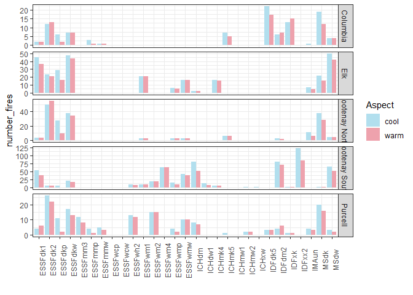<!-- -->

```r
ggplot(data=Modern, aes(x=Region_Name, y=mean_fs_BEC)) +
  geom_col(stat="identity", position = "dodge", aes(fill=Aspect)) +
  scale_fill_manual(values=c("lightblue2", "lightpink2")) +
  facet_grid(Zone~., scales="free_y") +
  theme_bw() +
  theme(axis.text.x = element_text(angle = 90))
```

```
## Warning: Ignoring unknown parameters: stat

## Warning: Removed 17 rows containing missing values (geom_col).
```

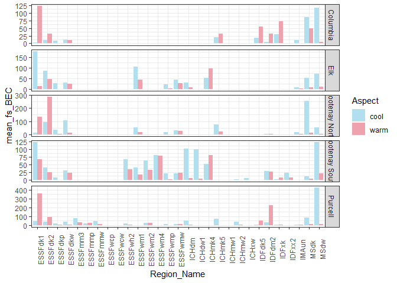<!-- -->

```r
ggplot(data=Modern, aes(x=Region_Name, y=min_fs_BEC)) +
  geom_col(stat="identity", position = "dodge", aes(fill=Aspect)) +
  scale_fill_manual(values=c("lightblue2", "lightpink2")) +
  facet_grid(Zone~., scales="free_y") +
  labs(x = "") +
  theme_bw() +
  theme(axis.text.x = element_text(angle = 90))
```

```
## Warning: Ignoring unknown parameters: stat

## Warning: Removed 17 rows containing missing values (geom_col).
```

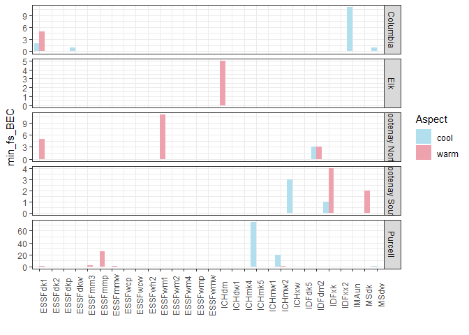<!-- -->

```r
ggplot(data=Modern, aes(x=Region_Name, y=max_fs_BEC)) +
  geom_col(stat="identity", position = "dodge", aes(fill=Aspect)) +
  scale_fill_manual(values=c("lightblue2", "lightpink2")) +
  facet_grid(Zone~., scales="free_y") +
  labs(x = "") +
  theme_bw() +
  theme(axis.text.x = element_text(angle = 90))
```

```
## Warning: Ignoring unknown parameters: stat

## Warning: Removed 17 rows containing missing values (geom_col).
```

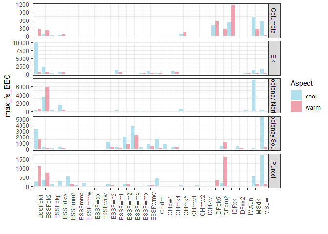<!-- -->

```r
ggplot(data=Modern, aes(x=Region_Name, y=FRI)) +
  geom_col(stat="identity", position = "dodge", aes(fill=Aspect)) +
  scale_fill_manual(values=c("lightblue2", "lightpink2")) +
  facet_grid(Zone~., scales="free_y") +
  labs(x = "") +
  theme_bw() +
  theme(axis.text.x = element_text(angle = 90))
```

```
## Warning: Ignoring unknown parameters: stat
```

```
## Warning: Removed 18 rows containing missing values (geom_col).
```

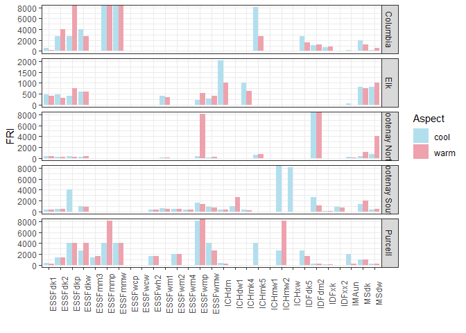<!-- -->


```r
ggplot(data = Modern, aes(x=Zone, y =mean_fs_BEC, fill=Aspect)) +
  geom_boxplot(outlier.shape=NA) +
  geom_jitter(size=1, alpha=0.5) +
  scale_fill_manual(values=c("lightblue2", "lightpink2")) +
  theme_bw() +
  theme(axis.text.x = element_text(angle = 90))
```

```
## Warning: Removed 17 rows containing non-finite values (stat_boxplot).
```

```
## Warning: Removed 17 rows containing missing values (geom_point).
```

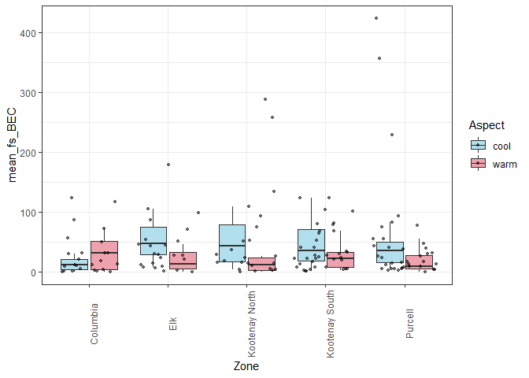<!-- -->

```r
ggplot(data = Modern, aes(x=Zone, y =min_fs_BEC, fill=Aspect)) +
  geom_boxplot(outlier.shape=NA) +
  geom_jitter(size=1, alpha=0.5) +
  scale_fill_manual(values=c("lightblue2", "lightpink2")) +
  theme_bw() +
  theme(axis.text.x = element_text(angle = 90))
```

```
## Warning: Removed 17 rows containing non-finite values (stat_boxplot).

## Warning: Removed 17 rows containing missing values (geom_point).
```

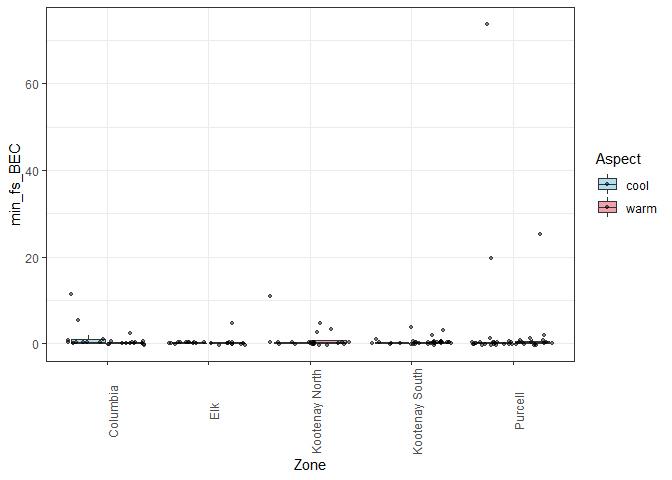<!-- -->

```r
ggplot(data = Modern, aes(x=Zone, y =max_fs_BEC, fill=Aspect)) +
  geom_boxplot(outlier.shape=NA) +
  geom_jitter(size=1, alpha=0.5) +
  scale_fill_manual(values=c("lightblue2", "lightpink2")) +
  theme_bw() +
  theme(axis.text.x = element_text(angle = 90))
```

```
## Warning: Removed 17 rows containing non-finite values (stat_boxplot).

## Warning: Removed 17 rows containing missing values (geom_point).
```

<!-- -->

```r
ggplot(data = Modern, aes(x=Zone, y =FRI, fill=Aspect)) +
  geom_boxplot(outlier.shape=NA) +
  geom_jitter(size=1, alpha=0.5) +
  scale_fill_manual(values=c("lightblue2", "lightpink2")) +
  theme_bw() +
  theme(axis.text.x = element_text(angle = 90))
```

```
## Warning: Removed 27 rows containing non-finite values (stat_boxplot).
```

```
## Warning: Removed 27 rows containing missing values (geom_point).
```

<!-- -->

## Subzone


```r
Columbia_Fuel2 <- read.csv("data/BEC_Fuel_Columbia.csv")
Elk_Fuel2 <- read.csv("data/BEC_Fuel_Elk.csv")
KootenayN_Fuel2 <- read.csv("data/BEC_Fuel_Kootenay_North.csv")
KootenayS_Fuel2 <- read.csv("data/BEC_Fuel_Kootenay_South.csv")
Purcell_Fuel2 <- read.csv("data/BEC_Fuel_Purcell.csv")

Columbia_Fire2 <- read.csv("data/BEC_Fire_Subzone_Columbia.csv") %>%
  filter(FIRE_YEAR >= 1940, Calculate_Size_Ha > 0, SIZE_HA > 0)
Elk_Fire2 <- read.csv("data/BEC_Fire_Subzone_Elk.csv") %>%
  filter(FIRE_YEAR >= 1940, Calculate_Size_Ha > 0, SIZE_HA > 0)
KootenayN_Fire2 <- read.csv("data/BEC_Fire_Subzone_Kootenay_North.csv") %>%
  filter(FIRE_YEAR >= 1940, Calculate_Size_Ha > 0, SIZE_HA > 0)
KootenayS_Fire2 <- read.csv("data/BEC_Fire_Subzone_Kootenay_South.csv") %>%
  filter(FIRE_YEAR >= 1940)
Purcell_Fire2 <- read.csv("data/BEC_Fire_Subzone_Purcell.csv") %>%
  filter(FIRE_YEAR >= 1940, Calculate_Size_Ha > 0, SIZE_HA > 0)
```


```r
Columbia_Modern2 <- Columbia_Fire2 %>% 
  group_by(MAP_LABEL) %>%
  summarize(number_fires = n_distinct(FIRELABEL), #number of unique fire events based on fire label
            mean_fs = mean(SIZE_HA) %>% round(2), 
            mean_fs_BEC = mean(Calculate_Size_Ha) %>% round(2),
            min_fs = min(SIZE_HA) %>% round(2),
            min_fs_BEC = min(Calculate_Size_Ha) %>% round(2),
            max_fs = max(SIZE_HA) %>% round(2),
            max_fs_BEC = max(Calculate_Size_Ha) %>% round(2),
            area_burned = sum(SIZE_HA) %>% round(2),
            area_burned_BEC = sum(Calculate_Size_Ha) %>% round(2))
Elk_Modern2 <- Elk_Fire2 %>% 
  group_by(MAP_LABEL) %>%
  summarize(number_fires = n_distinct(FIRELABEL), 
            mean_fs = mean(SIZE_HA) %>% round(2), 
            mean_fs_BEC = mean(Calculate_Size_Ha) %>% round(2),
            min_fs = min(SIZE_HA) %>% round(2),
            min_fs_BEC = min(Calculate_Size_Ha) %>% round(2),
            max_fs = max(SIZE_HA) %>% round(2),
            max_fs_BEC = max(Calculate_Size_Ha) %>% round(2),
            area_burned = sum(SIZE_HA) %>% round(2),
            area_burned_BEC = sum(Calculate_Size_Ha) %>% round(2))
KootenayN_Modern2 <- KootenayN_Fire2 %>% 
  group_by(MAP_LABEL) %>%
  summarize(number_fires = n_distinct(FIRELABEL), 
            mean_fs = mean(SIZE_HA) %>% round(2), 
            mean_fs_BEC = mean(Calculate_Size_Ha) %>% round(2),
            min_fs = min(SIZE_HA) %>% round(2),
            min_fs_BEC = min(Calculate_Size_Ha) %>% round(2),
            max_fs = max(SIZE_HA) %>% round(2),
            max_fs_BEC = max(Calculate_Size_Ha) %>% round(2),
            area_burned = sum(SIZE_HA) %>% round(2),
            area_burned_BEC = sum(Calculate_Size_Ha) %>% round(2))
KootenayS_Modern2 <- KootenayS_Fire2 %>% 
  group_by(MAP_LABEL) %>%
  summarize(number_fires = n_distinct(FIRELABEL), 
            mean_fs = mean(SIZE_HA) %>% round(2), 
            mean_fs_BEC = mean(Calculate_Size_Ha) %>% round(2),
            min_fs = min(SIZE_HA) %>% round(2),
            min_fs_BEC = min(Calculate_Size_Ha) %>% round(2),
            max_fs = max(SIZE_HA) %>% round(2),
            max_fs_BEC = max(Calculate_Size_Ha) %>% round(2),
            area_burned = sum(SIZE_HA) %>% round(2),
            area_burned_BEC = sum(Calculate_Size_Ha) %>% round(2))
Purcell_Modern2 <- Purcell_Fire2 %>% 
  group_by(MAP_LABEL) %>%
  summarize(number_fires = n_distinct(FIRELABEL), 
            mean_fs = mean(SIZE_HA) %>% round(2), 
            mean_fs_BEC = mean(Calculate_Size_Ha) %>% round(2),
            min_fs = min(SIZE_HA) %>% round(2),
            min_fs_BEC = min(Calculate_Size_Ha) %>% round(2),
            max_fs = max(SIZE_HA) %>% round(2),
            max_fs_BEC = max(Calculate_Size_Ha) %>% round(2),
            area_burned = sum(SIZE_HA) %>% round(2),
            area_burned_BEC = sum(Calculate_Size_Ha) %>% round(2))
```


### Fire Rotation Interval

Calculate flammable area in each BEC subzone for FRI calculation


```r
Columbia_Fuel_Area2 <- Columbia_Fuel2 %>% 
  group_by(MAP_LABEL) %>%
  summarize(total_area = sum(Calculate_Area_Ha) %>% round(2)) 
Elk_Fuel_Area2 <- Elk_Fuel2 %>% 
  group_by(MAP_LABEL) %>%
  summarize(total_area = sum(Calculate_Area_Ha) %>% round(2)) 
KootenayN_Fuel_Area2 <- KootenayN_Fuel2 %>% 
  group_by(MAP_LABEL) %>%
  summarize(total_area = sum(Calculate_Area_Ha) %>% round(2)) 
KootenayS_Fuel_Area2 <- KootenayS_Fuel2 %>% 
  group_by(MAP_LABEL) %>%
  summarize(total_area = sum(Calculate_Area_Ha) %>% round(2)) 
Purcell_Fuel_Area2 <- Purcell_Fuel2 %>% 
  group_by(MAP_LABEL) %>%
  summarize(total_area = sum(Calculate_Area_Ha) %>% round(2)) 
```


```r
years = (2020-1940+1) # Time period for fire events

Columbia_Modern2 <- full_join(Columbia_Modern2, Columbia_Fuel_Area2) %>%
  mutate(FRI.percent = (area_burned_BEC/total_area)*100 %>% round(0),
         FRI = years / (area_burned_BEC/total_area) %>% round(2),
         Region = "Columbia")
```

```
## Joining, by = "MAP_LABEL"
```

```r
Elk_Modern2 <- full_join(Elk_Modern2, Elk_Fuel_Area2) %>%
  mutate(FRI.percent = (area_burned_BEC/total_area)*100 %>% round(2),
         FRI = years / (area_burned_BEC/total_area) %>% round(2),
          Region = "Elk")
```

```
## Joining, by = "MAP_LABEL"
```

```r
KootenayN_Modern2 <- full_join(KootenayN_Modern2, KootenayN_Fuel_Area2) %>%
  mutate(FRI.percent = (area_burned_BEC/total_area)*100 %>% round(2),
         FRI = years / (area_burned_BEC/total_area) %>% round(2),
         Region = "Kootenay North")
```

```
## Joining, by = "MAP_LABEL"
```

```r
KootenayS_Modern2 <- full_join(KootenayS_Modern2, KootenayS_Fuel_Area2) %>%
  mutate(FRI.percent = (area_burned_BEC/total_area)*100 %>% round(2),
         FRI = years / (area_burned_BEC/total_area) %>% round(2),
         Region = "Kootenay South")
```

```
## Joining, by = "MAP_LABEL"
```

```r
Purcell_Modern2 <- full_join(Purcell_Modern2, Purcell_Fuel_Area2) %>%
  mutate(FRI.percent = (area_burned_BEC/total_area)*100 %>% round(2),
         FRI = years / (area_burned_BEC/total_area) %>% round(2),
         Region = "Purcell")
```

```
## Joining, by = "MAP_LABEL"
```

```r
Modern2 <- rbind(Columbia_Modern2, Elk_Modern2, KootenayN_Modern2, KootenayS_Modern2, Purcell_Modern2) %>%
  ungroup() %>%
  rename(Zone = Region, Region_Name = MAP_LABEL) %>%
  select(Zone, Region_Name, number_fires, mean_fs_BEC, min_fs_BEC, max_fs_BEC, FRI) %>%
  relocate(Zone, Region_Name) %>%
  mutate_if(is.character,as.factor) %>%
  mutate_if(is.numeric, round, 0)
```

### Visualize


```r
ggplot(data=Modern2, aes(x=Region_Name, y=number_fires)) +
  geom_col(stat="identity", position = "dodge") +
  labs(x = "") +
  facet_grid(Zone~., scales="free_y") +
  theme_bw() +
  theme(axis.text.x = element_text(angle = 90))
```

```
## Warning: Ignoring unknown parameters: stat
```

```
## Warning: Removed 6 rows containing missing values (geom_col).
```

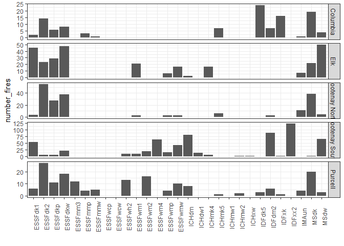<!-- -->

```r
ggplot(data=Modern2, aes(x=Region_Name, y=mean_fs_BEC)) +
  geom_col(stat="identity", position = "dodge") +
  facet_grid(Zone~., scales="free_y") +  labs(x = "") +
  theme_bw() +
  theme(axis.text.x = element_text(angle = 90))
```

```
## Warning: Ignoring unknown parameters: stat

## Warning: Removed 6 rows containing missing values (geom_col).
```

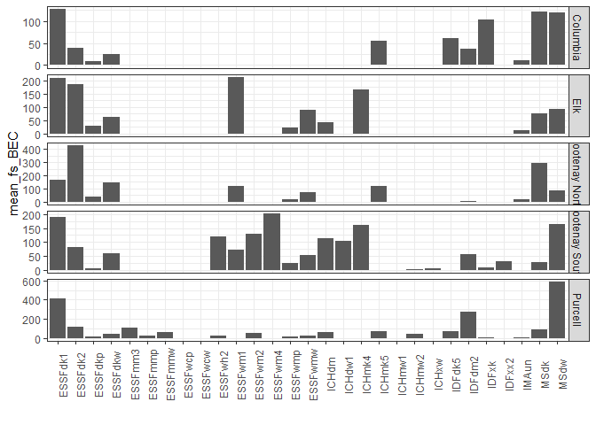<!-- -->

```r
ggplot(data=Modern2, aes(x=Region_Name, y=min_fs_BEC)) +
  geom_col(stat="identity", position = "dodge") +
  facet_grid(Zone~., scales="free_y") +  
  labs(x = "") +
  theme_bw() +
  theme(axis.text.x = element_text(angle = 90))
```

```
## Warning: Ignoring unknown parameters: stat

## Warning: Removed 6 rows containing missing values (geom_col).
```

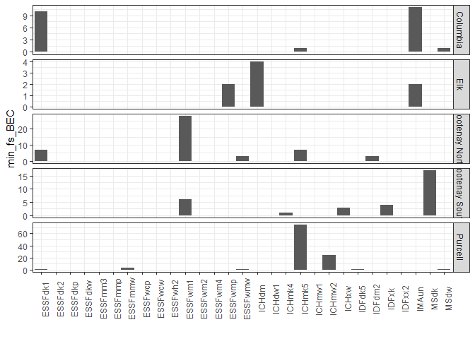<!-- -->

```r
ggplot(data=Modern2, aes(x=Region_Name, y=max_fs_BEC)) +
  geom_col(stat="identity", position = "dodge") +
  facet_grid(Zone~., scales="free_y") +
  labs(x = "") +
  theme_bw() +
  theme(axis.text.x = element_text(angle = 90))
```

```
## Warning: Ignoring unknown parameters: stat

## Warning: Removed 6 rows containing missing values (geom_col).
```

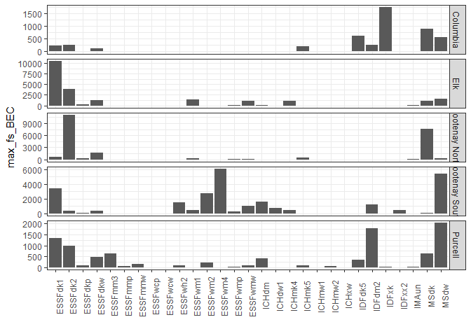<!-- -->

```r
ggplot(data=Modern2, aes(x=Region_Name, y=FRI)) +
  geom_col(stat="identity", position = "dodge") +
  scale_fill_manual(values=c("lightpink2", "lightblue2")) +
  facet_grid(Zone~., scales="free_y") +
  labs(x = "") +
  theme_bw() +
  theme(axis.text.x = element_text(angle = 90))
```

```
## Warning: Ignoring unknown parameters: stat

## Warning: Removed 6 rows containing missing values (geom_col).
```

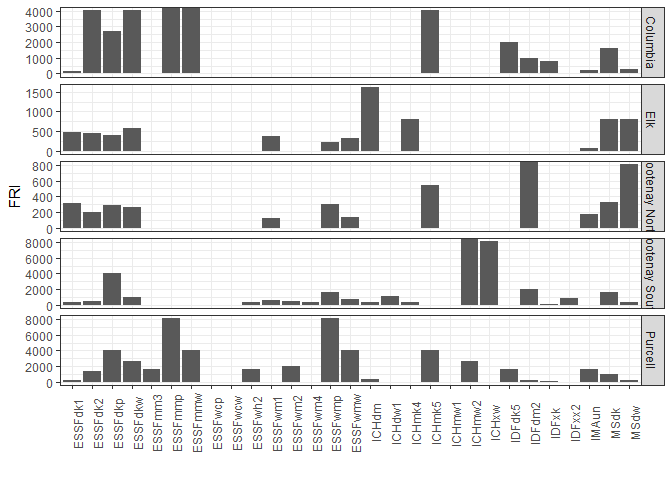<!-- -->


```r
ggplot(data = Modern2, aes(x=Zone, y =mean_fs_BEC)) +
  geom_boxplot(outlier.shape=NA) +
  geom_jitter(size=1, alpha=0.5) +
  theme_bw() +
  theme(axis.text.x = element_text(angle = 90))
```

```
## Warning: Removed 6 rows containing non-finite values (stat_boxplot).
```

```
## Warning: Removed 6 rows containing missing values (geom_point).
```

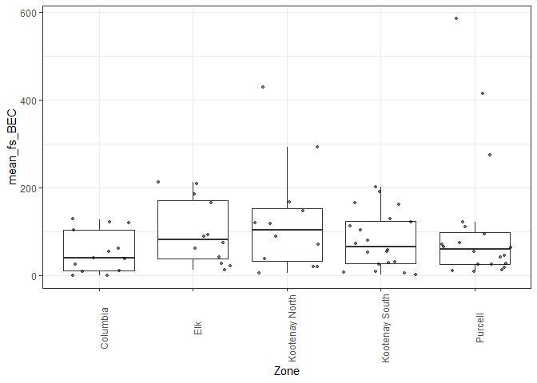<!-- -->

```r
ggplot(data = Modern2, aes(x=Zone, y =min_fs_BEC)) +
  geom_boxplot(outlier.shape=NA) +
  geom_jitter(size=1, alpha=0.5) +
  theme_bw() +
  theme(axis.text.x = element_text(angle = 90))
```

```
## Warning: Removed 6 rows containing non-finite values (stat_boxplot).

## Warning: Removed 6 rows containing missing values (geom_point).
```

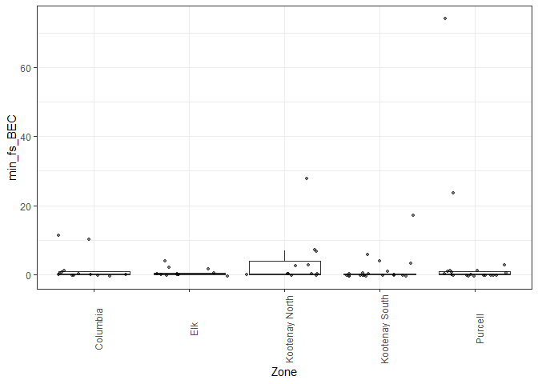<!-- -->

```r
ggplot(data = Modern2, aes(x=Zone, y =max_fs_BEC)) +
  geom_boxplot(outlier.shape=NA) +
  geom_jitter(size=1, alpha=0.5) +
  theme_bw() +
  theme(axis.text.x = element_text(angle = 90))
```

```
## Warning: Removed 6 rows containing non-finite values (stat_boxplot).

## Warning: Removed 6 rows containing missing values (geom_point).
```

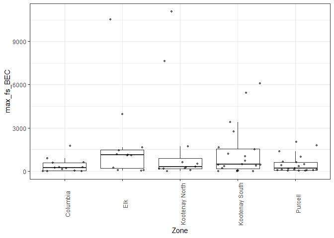<!-- -->

```r
ggplot(data = Modern2, aes(x=Zone, y =FRI)) +
  geom_boxplot(outlier.shape=NA) +
  geom_jitter(size=1, alpha=0.5) +
  theme_bw() +
  theme(axis.text.x = element_text(angle = 90))
```

```
## Warning: Removed 10 rows containing non-finite values (stat_boxplot).
```

```
## Warning: Removed 10 rows containing missing values (geom_point).
```

<!-- -->

# Combine


```r
Modern_Tidy <- full_join(Modern, Modern2, 
          by=c("Zone","Region_Name"),
          suffix = c(".aspect", ""),) %>% 
  select(Zone, Region_Name, Aspect, 
                             number_fires, number_fires.aspect,
                             mean_fs_BEC, mean_fs_BEC.aspect,
                             min_fs_BEC, min_fs_BEC.aspect,
                             max_fs_BEC, max_fs_BEC.aspect,
                             FRI, FRI.aspect) %>%
  relocate(Zone, Region_Name, Aspect, 
                             number_fires, number_fires.aspect,
                             mean_fs_BEC, mean_fs_BEC.aspect,
                             min_fs_BEC, min_fs_BEC.aspect,
                             max_fs_BEC, max_fs_BEC.aspect,
                             FRI, FRI.aspect) %>%
  ungroup() %>%
  mutate_if(is.character,as.factor) %>%
  mutate_if(is.numeric, round, 0)
```


# Save Outputs


```r
write.csv(Modern, "outputs/modern_subzone_aspect.csv")
write.csv(Modern2, "outputs/modern_subzone.csv")
write.csv(Modern_Tidy, "outputs/modern.csv")
```


# Reproducibility


```r
Sys.time()
```

```
## [1] "2021-12-16 16:15:12 PST"
```

```r
git2r::repository()
```

```
## Local:    main C:/Users/jenbaron/Documents/UBC/Research/PhD Thesis/Collaborations/LANDIS II/Analysis/LANDISII_EK
## Remote:   main @ origin (https://github.com/JenBaron/LANDISII_EK.git)
## Head:     [95a5cd3] 2021-12-15: display summaries
```

```r
sessionInfo()
```

```
## R version 4.1.2 (2021-11-01)
## Platform: x86_64-w64-mingw32/x64 (64-bit)
## Running under: Windows 10 x64 (build 19042)
## 
## Matrix products: default
## 
## locale:
## [1] LC_COLLATE=English_United States.1252 
## [2] LC_CTYPE=English_United States.1252   
## [3] LC_MONETARY=English_United States.1252
## [4] LC_NUMERIC=C                          
## [5] LC_TIME=English_United States.1252    
## 
## attached base packages:
## [1] stats     graphics  grDevices utils     datasets  methods   base     
## 
## other attached packages:
## [1] ggplot2_3.3.5 dplyr_1.0.7  
## 
## loaded via a namespace (and not attached):
##  [1] git2r_0.29.0     highr_0.9        pillar_1.6.4     bslib_0.3.1     
##  [5] compiler_4.1.2   jquerylib_0.1.4  tools_4.1.2      digest_0.6.28   
##  [9] jsonlite_1.7.2   evaluate_0.14    lifecycle_1.0.1  tibble_3.1.6    
## [13] gtable_0.3.0     pkgconfig_2.0.3  rlang_0.4.12     DBI_1.1.1       
## [17] yaml_2.2.1       xfun_0.28        fastmap_1.1.0    withr_2.4.2     
## [21] stringr_1.4.0    knitr_1.36       generics_0.1.1   vctrs_0.3.8     
## [25] sass_0.4.0       grid_4.1.2       tidyselect_1.1.1 glue_1.5.0      
## [29] R6_2.5.1         fansi_0.5.0      rmarkdown_2.11   farver_2.1.0    
## [33] purrr_0.3.4      magrittr_2.0.1   scales_1.1.1     ellipsis_0.3.2  
## [37] htmltools_0.5.2  assertthat_0.2.1 colorspace_2.0-2 labeling_0.4.2  
## [41] utf8_1.2.2       stringi_1.7.5    munsell_0.5.0    crayon_1.4.2
```
