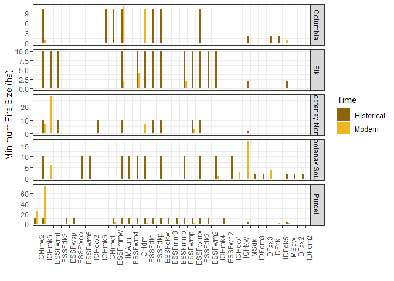
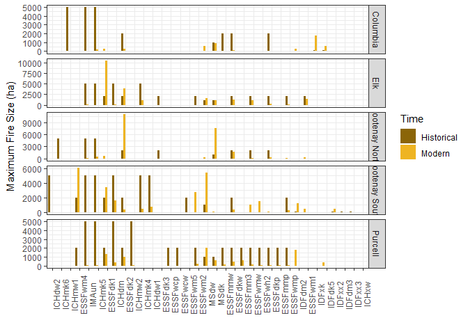
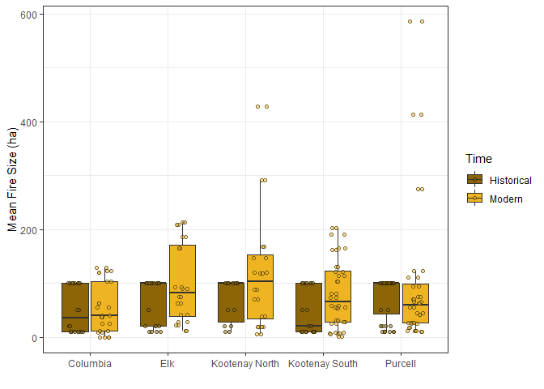
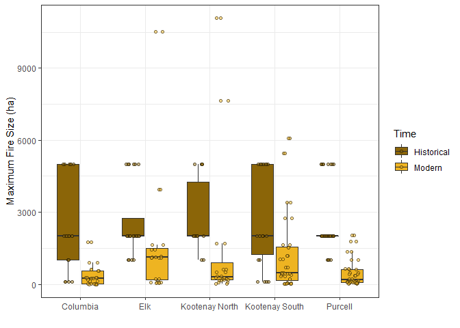
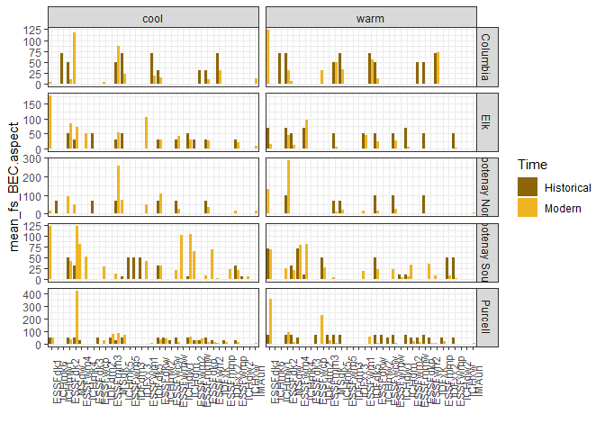
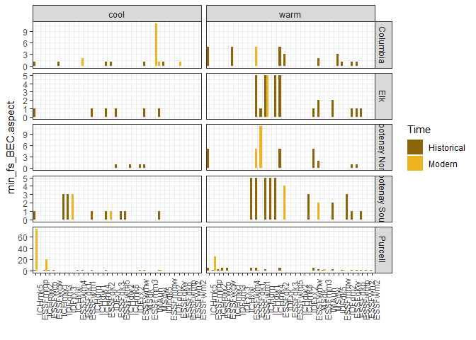
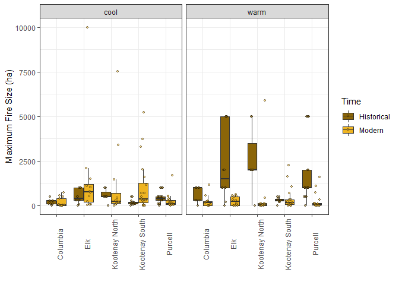

# Load Packages


```r
library(dplyr)
library(ggplot2)
```

# Read Data


```r
modern <- read.csv("outputs/modern.csv") %>%
  select(-X) %>%
  mutate(Time = "Modern") %>%
  relocate(Time) %>%
  mutate_if(is.character,as.factor) 
historical <- read.csv("data/BEC_HNFR_Tidy.csv") %>%
  mutate(Time = "Historical") %>%
  relocate(Time) %>%
  mutate_if(is.character,as.factor)
```

# Tidy Data


```r
compare_wide <- left_join(historical, modern, by = c("Zone", "Region_Name", "Aspect"),
                    suffix = c(".H", ".M"),) %>%
  select(Zone, Region_Name, Aspect,
           mean_fs_BEC.H, mean_fs_BEC.M,
           mean_fs_BEC.aspect.H, mean_fs_BEC.aspect.M,
           min_fs_BEC.H, min_fs_BEC.M,
           min_fs_BEC.aspect.H, min_fs_BEC.aspect.M,
           max_fs_BEC.H, max_fs_BEC.M,
           max_fs_BEC.aspect.H, max_fs_BEC.aspect.M,
           FRI.H, FRI.M,
           FRI.aspect.H, FRI.aspect.M) %>%
  relocate(Zone, Region_Name, Aspect,
           mean_fs_BEC.H, mean_fs_BEC.M,
           mean_fs_BEC.aspect.H, mean_fs_BEC.aspect.M,
           min_fs_BEC.H, min_fs_BEC.M,
           min_fs_BEC.aspect.H, min_fs_BEC.aspect.M,
           max_fs_BEC.H, max_fs_BEC.M,
           max_fs_BEC.aspect.H, max_fs_BEC.aspect.M,
           FRI.H, FRI.M,
           FRI.aspect.H, FRI.aspect.M)
```


```r
compare_tidy <- full_join(historical, modern) %>%
  select("Time", "Zone", "Region_Name", "Aspect", 
         "mean_fs_BEC", "mean_fs_BEC.aspect", "min_fs_BEC", 
         "min_fs_BEC.aspect", "max_fs_BEC", "max_fs_BEC.aspect", 
         "FRI", "FRI.aspect") 
#mutate_if(is.integer,as.numeric)
```

```r
subzone.summary <- compare_tidy %>%
  group_by(Time, Zone) %>%
  na.omit() %>%
  summarize(mean_fs = mean(mean_fs_BEC),
            min_fs = mean(min_fs_BEC),
            max_fs = mean(max_fs_BEC),
            FRI = mean(FRI)) %>%
  arrange(Zone) %>%
  mutate_if(is.numeric, round, 0)
subzone.summary
```

```
## # A tibble: 10 x 6
## # Groups:   Time [2]
##    Time       Zone           mean_fs min_fs max_fs   FRI
##    <fct>      <fct>            <dbl>  <dbl>  <dbl> <dbl>
##  1 Historical Columbia            51      8   2420   222
##  2 Modern     Columbia            70      2    494  1948
##  3 Historical Elk                 68      9   2583   266
##  4 Modern     Elk                103      1   1952   597
##  5 Historical Kootenay North      69      9   2714   246
##  6 Modern     Kootenay North     137      4   2066   315
##  7 Historical Kootenay South      47      8   2655   190
##  8 Modern     Kootenay South      89      2   1452  1048
##  9 Historical Purcell             76      9   2500   257
## 10 Modern     Purcell            111      4    503  2303
```

```r
subzone.aspect.summary <- compare_tidy %>%
  group_by(Time, Zone, Aspect) %>%
  na.omit() %>%
  summarize(mean_fs = mean(mean_fs_BEC.aspect),
            min_fs = mean(min_fs_BEC.aspect),
            max_fs = mean(max_fs_BEC.aspect),
            FRI = mean(FRI)) %>%
  arrange(Zone, Aspect) %>%
  mutate_if(is.numeric, round, 0)
subzone.aspect.summary
```

```
## # A tibble: 20 x 7
## # Groups:   Time, Zone [10]
##    Time       Zone           Aspect mean_fs min_fs max_fs   FRI
##    <fct>      <fct>          <fct>    <dbl>  <dbl>  <dbl> <dbl>
##  1 Historical Columbia       cool        47      1    205   222
##  2 Modern     Columbia       cool        29      1    218  1903
##  3 Historical Columbia       warm        55      3    690   222
##  4 Modern     Columbia       warm        46      1    321  2004
##  5 Historical Elk            cool        34      0    523   266
##  6 Modern     Elk            cool        59      0   1518   575
##  7 Historical Elk            warm        52      2   2350   266
##  8 Modern     Elk            warm        25      0    280   622
##  9 Historical Kootenay North cool        60      1    571   246
## 10 Modern     Kootenay North cool        68      0   1274   315
## 11 Historical Kootenay North warm        77      3   2571   246
## 12 Modern     Kootenay North warm        47      1    620   315
## 13 Historical Kootenay South cool        28      1    186   190
## 14 Modern     Kootenay South cool        49      0   1097  1313
## 15 Historical Kootenay South warm        36      3    300   190
## 16 Modern     Kootenay South warm        27      0    436   753
## 17 Historical Purcell        cool        40      1    455   257
## 18 Modern     Purcell        cool        53      5    251  2491
## 19 Historical Purcell        warm        60      3   1775   257
## 20 Modern     Purcell        warm        49      2    245  2093
```

# Visualize

## Subzone


```r
ggplot(data=(compare_tidy %>% na.omit(mean_fs_BEC)), 
       aes(x=reorder(Region_Name, -mean_fs_BEC), y=mean_fs_BEC)) +
  geom_col(stat="identity", aes(fill=Time), position = position_dodge(preserve = "single")) +
  scale_fill_manual(values=c("darkgoldenrod4", "goldenrod2")) +
  labs(x = "") +
  facet_grid(Zone~., scales="free_y") +
  labs(y= "Mean Fire Size (ha)", x = "") +
  theme_bw() +
  theme(axis.text.x = element_text(angle = 90))
```

<!-- -->

```r
ggplot(data=(compare_tidy %>% na.omit(min_fs_BEC)), 
       aes(x=reorder(Region_Name, -min_fs_BEC), y=min_fs_BEC)) +
  geom_col(stat="identity", aes(fill=Time), position = position_dodge(preserve = "single")) +
  scale_fill_manual(values=c("darkgoldenrod4", "goldenrod2")) +
  labs(x = "") +
  facet_grid(Zone~., scales="free_y") +
  labs(y= "Minimum Fire Size (ha)", x = "") +
  theme_bw() +
  theme(axis.text.x = element_text(angle = 90))
```

<!-- -->

```r
ggplot(data=(compare_tidy %>% na.omit(max_fs_BEC)), 
       aes(x=reorder(Region_Name, -max_fs_BEC), y=max_fs_BEC)) +
  geom_col(stat="identity", aes(fill=Time), position = position_dodge(preserve = "single")) +
  scale_fill_manual(values=c("darkgoldenrod4", "goldenrod2")) +
  labs(y= "Maximum Fire Size (ha)", x = "") +
  labs(x = "") +
  facet_grid(Zone~., scales="free_y") +
  theme_bw() +
  theme(axis.text.x = element_text(angle = 90))
```

<!-- -->

```r
ggplot(data=(compare_tidy %>% na.omit(FRI)), 
       aes(x=reorder(Region_Name, -FRI), y=FRI)) +
  geom_col(stat="identity", aes(fill=Time), position = position_dodge(preserve = "single")) +
  scale_fill_manual(values=c("darkgoldenrod4", "goldenrod2")) +
  labs(y= "Fire Rotation Interval (years)", x = "") +
  labs(x = "") +
  facet_grid(Zone~., scales="free_y") +
  theme_bw() +
  theme(axis.text.x = element_text(angle = 90))
```

<!-- -->


```r
ggplot(data = compare_tidy, aes(x=Zone, y =mean_fs_BEC, fill=Time)) +
  geom_boxplot(outlier.shape=NA) +
  geom_point(pch=21,position = position_jitterdodge(), size=1, alpha=0.5, stroke=1) +
  scale_fill_manual(values=c("darkgoldenrod4", "goldenrod2")) +
  labs(y= "Mean Fire Size (ha)", x = "") +
  theme_bw()
```

<!-- -->

```r
ggplot(data = compare_tidy, aes(x=Zone, y =min_fs_BEC, fill=Time)) +
  geom_boxplot(outlier.shape=NA) +
  geom_point(pch=21,position = position_jitterdodge(), size=1, alpha=0.5, stroke=1) +
  scale_fill_manual(values=c("darkgoldenrod4", "goldenrod2")) +
  labs(y= "Minimum Fire Size (ha)", x = "") +
  theme_bw()
```

<!-- -->

```r
ggplot(data = compare_tidy, aes(x=Zone, y =max_fs_BEC, fill=Time)) +
  geom_boxplot(outlier.shape=NA) +
  geom_point(pch=21,position = position_jitterdodge(), size=1, alpha=0.5, stroke=1) +
  scale_fill_manual(values=c("darkgoldenrod4", "goldenrod2")) +
  labs(y= "Maximum Fire Size (ha)", x = "") +
  theme_bw()
```

<!-- -->

```r
ggplot(data = compare_tidy, aes(x=Zone, y =FRI, fill=Time)) +
  geom_boxplot(outlier.shape=NA) +
  geom_point(pch=21,position = position_jitterdodge(), size=1, alpha=0.5, stroke=1) +
  scale_fill_manual(values=c("darkgoldenrod4", "goldenrod2")) +
  labs(y= "Fire Rotation Interval (years)", x = "") +
  theme_bw()
```

<!-- -->


## Subzone & Aspect


```r
ggplot(data=(compare_tidy %>% na.omit(mean_fs_BEC.aspect)), 
       aes(x=reorder(Region_Name, -mean_fs_BEC.aspect), y=mean_fs_BEC.aspect)) +
  geom_col(stat="identity", aes(fill=Time), position = position_dodge(preserve = "single")) +
  scale_fill_manual(values=c("darkgoldenrod4", "goldenrod2")) +
  labs(x = "") +
  facet_grid(Zone~Aspect, scales="free_y") +
  theme_bw() +
  theme(axis.text.x = element_text(angle = 90))
```

<!-- -->

```r
ggplot(data=(compare_tidy %>% na.omit(min_fs_BEC.aspect)), 
       aes(x=reorder(Region_Name, -min_fs_BEC.aspect), y=min_fs_BEC.aspect)) +
  geom_col(stat="identity", aes(fill=Time), position = position_dodge(preserve = "single")) +
  scale_fill_manual(values=c("darkgoldenrod4", "goldenrod2")) +
  labs(x = "") +
  facet_grid(Zone~Aspect, scales="free_y") +
  theme_bw() +
  theme(axis.text.x = element_text(angle = 90))
```

<!-- -->

```r
ggplot(data=(compare_tidy %>% na.omit(max_fs_BEC.aspect)), 
       aes(x=reorder(Region_Name, -max_fs_BEC.aspect), y=max_fs_BEC.aspect)) +
  geom_col(stat="identity", aes(fill=Time), position = position_dodge(preserve = "single")) +
  scale_fill_manual(values=c("darkgoldenrod4", "goldenrod2")) +
  labs(x = "") +
  facet_grid(Zone~Aspect, scales="free_y") +
  theme_bw() +
  theme(axis.text.x = element_text(angle = 90))
```

<!-- -->

```r
ggplot(data=(compare_tidy %>% na.omit(FRI.aspect)), 
       aes(x=reorder(Region_Name, -FRI.aspect), y=FRI.aspect)) +
  geom_col(stat="identity", aes(fill=Time), position = position_dodge(preserve = "single")) +
  scale_fill_manual(values=c("darkgoldenrod4", "goldenrod2")) +
  labs(x = "") +
  facet_grid(Zone~Aspect, scales="free_y") +
  theme_bw() +
  theme(axis.text.x = element_text(angle = 90))
```

<!-- -->


```r
ggplot(data = compare_tidy, aes(x=Zone, y =mean_fs_BEC.aspect, fill=Time)) +
  geom_boxplot(outlier.shape=NA) +
  geom_point(pch=21,position = position_jitterdodge(), size=0.8, alpha=0.5, stroke=1) +
  scale_fill_manual(values=c("darkgoldenrod4", "goldenrod2")) +
  facet_grid(.~Aspect) +
  theme_bw() +
  labs(y= "Mean Fire Size (ha)", x = "") +
  theme(axis.text.x = element_text(angle = 90))
```

<!-- -->

```r
ggplot(data = compare_tidy, aes(x=Zone, y =min_fs_BEC.aspect, fill=Time)) +
  geom_boxplot(outlier.shape=NA) +
  geom_point(pch=21,position = position_jitterdodge(), size=0.8, alpha=0.5, stroke=1) +
  scale_fill_manual(values=c("darkgoldenrod4", "goldenrod2")) +
  facet_grid(.~Aspect) +
  labs(y= "Minimum Fire Size (ha)", x = "") +
  theme_bw() +
  theme(axis.text.x = element_text(angle = 90))
```

<!-- -->

```r
ggplot(data = compare_tidy, aes(x=Zone, y =max_fs_BEC.aspect, fill=Time)) +
  geom_boxplot(outlier.shape=NA) +
  geom_point(pch=21,position = position_jitterdodge(), size=0.8, alpha=0.5, stroke=1) +
  scale_fill_manual(values=c("darkgoldenrod4", "goldenrod2")) +
  facet_grid(.~Aspect) +
  labs(y= "Maximum Fire Size (ha)", x = "") +
  theme_bw() +
  theme(axis.text.x = element_text(angle = 90))
```

<!-- -->

```r
ggplot(data = compare_tidy, aes(x=Zone, y =FRI.aspect, fill=Time)) +
  geom_boxplot(outlier.shape=NA) +
  geom_point(pch=21,position = position_jitterdodge(), size=0.8, alpha=0.5, stroke=1) +
  scale_fill_manual(values=c("darkgoldenrod4", "goldenrod2")) +
  facet_grid(.~Aspect) +
  labs(y= "Fire Rotation Interval (years)", x = "") +
  theme_bw() +
  theme(axis.text.x = element_text(angle = 90))
```

<!-- -->


 
# Save Outputs


```r
write.csv(compare_wide, "outputs/compare_wide.csv")
write.csv(compare_tidy, "outputs/compare_tidy.csv")
write.csv(subzone.summary, "outputs/subzone_summary.csv")
write.csv(subzone.aspect.summary, "outputs/subzone_summary_aspect.csv")
```


# Reproducibility


```r
Sys.time()
```

```
## [1] "2022-01-10 16:49:39 PST"
```

```r
git2r::repository()
```

```
## Local:    main C:/Users/jenbaron/Documents/UBC/Research/PhD Thesis/Collaborations/LANDIS II/Analysis/LANDISII_EK
## Remote:   main @ origin (https://github.com/JenBaron/LANDISII_EK.git)
## Head:     [46e6525] 2021-12-17: Omit NA values
```

```r
sessionInfo()
```

```
## R version 4.1.2 (2021-11-01)
## Platform: x86_64-w64-mingw32/x64 (64-bit)
## Running under: Windows 10 x64 (build 19042)
## 
## Matrix products: default
## 
## locale:
## [1] LC_COLLATE=English_United States.1252 
## [2] LC_CTYPE=English_United States.1252   
## [3] LC_MONETARY=English_United States.1252
## [4] LC_NUMERIC=C                          
## [5] LC_TIME=English_United States.1252    
## 
## attached base packages:
## [1] stats     graphics  grDevices utils     datasets  methods   base     
## 
## other attached packages:
## [1] ggplot2_3.3.5 dplyr_1.0.7  
## 
## loaded via a namespace (and not attached):
##  [1] git2r_0.29.0     highr_0.9        pillar_1.6.4     bslib_0.3.1     
##  [5] compiler_4.1.2   jquerylib_0.1.4  tools_4.1.2      digest_0.6.28   
##  [9] jsonlite_1.7.2   evaluate_0.14    lifecycle_1.0.1  tibble_3.1.6    
## [13] gtable_0.3.0     pkgconfig_2.0.3  rlang_0.4.12     rstudioapi_0.13 
## [17] cli_3.1.0        DBI_1.1.1        yaml_2.2.1       xfun_0.28       
## [21] fastmap_1.1.0    withr_2.4.2      stringr_1.4.0    knitr_1.36      
## [25] generics_0.1.1   vctrs_0.3.8      sass_0.4.0       grid_4.1.2      
## [29] tidyselect_1.1.1 glue_1.5.0       R6_2.5.1         fansi_0.5.0     
## [33] rmarkdown_2.11   farver_2.1.0     purrr_0.3.4      magrittr_2.0.1  
## [37] scales_1.1.1     ellipsis_0.3.2   htmltools_0.5.2  assertthat_0.2.1
## [41] colorspace_2.0-2 labeling_0.4.2   utf8_1.2.2       stringi_1.7.5   
## [45] munsell_0.5.0    crayon_1.4.2
```
